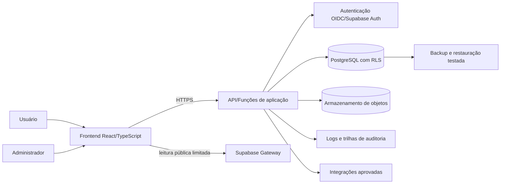

# Portal CARB - desenho do projeto

**Status:** proposta arquitetural para validação  
**Escopo:** portal web do CARB, da fase inicial em Supabase até a homologação e operação pela STI-UFBA  
**Documento mestre:** os detalhes de conformidade, segurança, privacidade, acessibilidade e migração estão nos documentos temáticos vinculados.

## 1. Classificação das declarações

| Classe | Significado | Tratamento |
|---|---|---|
| `OBR` | obrigação legal, normativa, institucional ou de homologação | bloqueia produção quando aplicável e não atendida |
| `REC` | recomendação ou boa prática | exige decisão registrada se não adotada |
| `DA` | decisão arquitetural vigente | pode mudar por ADR ou aprovação equivalente |
| `TBD` | informação indisponível ou dependente de autoridade | não deve ser preenchida por suposição |

## 2. Visão geral e objetivos

O Portal CARB substituirá o site atual e centralizará informações e serviços úteis aos estudantes da Faculdade de Direito da UFBA. O produto deverá:

1. reduzir a dispersão de avisos, links e oportunidades;
2. permitir acesso responsivo, compreensível e acessível;
3. minimizar a coleta de dados pessoais;
4. manter rastreabilidade de requisitos, alterações e evidências;
5. operar inicialmente com serviços gerenciados, sem criar dependências que inviabilizem a migração para a STI-UFBA;
6. demonstrar conformidade suficiente para homologação, operação e auditoria.

### 2.1 Escopo do MVP

| Módulo | Entrega mínima | Classificação |
|---|---|---|
| Avisos | feed público, busca, categorias, publicação administrativa | `DA-MOD-01` |
| Cursos | conteúdo acadêmico curado e links oficiais | `DA-MOD-02` |
| Sistemas | catálogo estático de links institucionais | `DA-MOD-03` |
| Vagas | publicação manual ou fonte formalmente autorizada | `DA-MOD-04` |
| Planejador de matrícula | montagem de grade no navegador, com conflitos de horário | `DA-MOD-05` |
| Carteirinha | solicitação autenticada e acompanhamento restrito | `DA-MOD-06` |

### 2.2 Fora do MVP

- raspagem ou uso não autorizado de LinkedIn;
- automação via WhatsApp/WAHA;
- AcademyCARB ou respostas por IA generativa;
- integração com sistemas acadêmicos sem API e autorização formais;
- armazenamento de documentos em contas pessoais ou serviços não homologados;
- qualquer teste ofensivo em infraestrutura da UFBA sem autorização e regras de engajamento.

Esses itens exigem avaliação específica e não são necessários para provar o valor inicial do portal (`DA-ARC-03`).

## 3. Arquitetura de referência

### 3.1 Camadas

1. **Apresentação:** React, TypeScript, Tailwind CSS e Shadcn/ui. HTML semântico e componentes acessíveis são requisitos, não acabamento.
2. **Aplicação:** API ou funções server-side concentram regras de negócio, validação, autorização e operações privilegiadas.
3. **Dados:** PostgreSQL como sistema de registro; RLS como defesa adicional, não substituto da autorização da aplicação.
4. **Identidade:** provedor compatível com OIDC. Supabase Auth é transitório; o provedor institucional será definido pela STI.
5. **Arquivos:** armazenamento de objetos privado, com URLs temporárias e política de retenção.
6. **Observabilidade:** logs estruturados, métricas operacionais e eventos de auditoria sem conteúdo pessoal desnecessário.

### 3.2 Restrições arquiteturais

- `OBR-ARC-01`: todo tráfego externo deve usar TLS; segredos não podem estar no frontend ou no repositório.
- `OBR-ARC-02`: operações administrativas e acesso a dados de carteirinha exigem autenticação, autorização por função e trilha de auditoria.
- `OBR-ARC-03`: a chave `service_role` do Supabase nunca pode ser entregue ao navegador.
- `OBR-ARC-04`: tabelas com dados pessoais devem ter RLS habilitada e políticas negativas por padrão.
- `DA-ARC-01`: stack frontend React + TypeScript + Tailwind + Shadcn/ui.
- `DA-ARC-02`: PostgreSQL/Supabase na fase inicial; esquema e migrações em SQL versionado.
- `REC-ARC-01`: preferir APIs padronizadas, dados em formatos abertos e contratos documentados.

## 4. Módulos e dados

| Módulo | Grão principal | Chave sugerida | Dados pessoais | Acesso |
|---|---|---|---|---|
| Avisos | um aviso publicado | `notice_id` UUID | autor/editor nos metadados internos | leitura pública; escrita administrativa |
| Cursos | um curso/componente informativo | `course_id` UUID ou código oficial | nenhum no conteúdo básico | leitura pública; escrita administrativa |
| Sistemas | um link institucional | `system_id` UUID | nenhum | leitura pública; escrita administrativa |
| Vagas | uma oportunidade | `opportunity_id` UUID | contato público da fonte, se autorizado | leitura pública; escrita administrativa |
| Planejador | uma grade temporária no dispositivo | identificador local | evitar persistência | usuário local |
| Carteirinha | uma solicitação por ciclo e estudante | `request_id` UUID + unicidade definida | sim | titular e equipe autorizada |
| Auditoria | um evento relevante | `audit_event_id` UUID | identificador mínimo do ator | equipe autorizada |

`TBD-DATA-01`: campos exatos, base legal, prazo de retenção e critério de unicidade da solicitação de carteirinha devem ser aprovados antes da implementação. CPF, documento, fotografia e matrícula não devem ser coletados por conveniência.

## 5. Fluxos de dados

### 5.1 Conteúdo público

1. administrador autentica-se;
2. API verifica função e estado da conta;
3. conteúdo é validado e gravado;
4. evento administrativo é registrado;
5. versão publicada torna-se disponível para leitura pública.

### 5.2 Planejador de matrícula

1. navegador carrega catálogo público;
2. estudante seleciona componentes;
3. conflitos são calculados localmente;
4. grade permanece no dispositivo, salvo decisão posterior formalmente justificada.

Essa escolha elimina uma operação de tratamento que não é necessária para a funcionalidade (`DA-PRIV-01`).

### 5.3 Solicitação de carteirinha

1. titular autentica-se;
2. aviso de privacidade contextual informa finalidade, base legal, campos, prazo e direitos;
3. frontend valida formato; API repete a validação no limite de confiança;
4. autorização e RLS restringem a linha ao titular e aos papéis administrativos necessários;
5. arquivo, se indispensável, é enviado a bucket privado;
6. mudanças de estado geram eventos de auditoria;
7. dados são eliminados ou anonimizados ao fim do prazo aprovado.

### 5.4 Incidente com dados pessoais

Detecção -> contenção -> preservação de evidências -> avaliação de risco/dano -> acionamento do controlador/encarregado/STI -> comunicação, quando aplicável -> recuperação -> causa raiz -> ações corretivas. Os prazos externos não começam no ticket: dependem do conhecimento do controlador de que dados pessoais foram afetados. Por isso, o fluxo interno deve escalar imediatamente.

## 6. Autenticação e autorização

- contas públicas não são necessárias para leitura de conteúdo (`DA-AUTH-01`);
- administração e carteirinha exigem autenticação (`OBR-AUTH-01`);
- MFA é obrigatório para administradores e recomendado para titulares (`OBR-AUTH-02`);
- papéis mínimos: `student`, `editor`, `card_operator`, `admin`, `auditor` (`DA-AUTH-02`);
- permissões devem ser atribuídas por menor privilégio e separação de funções (`OBR-AUTH-03`);
- contas e privilégios devem ter revisão periódica; desligamentos revogam acesso sem demora (`OBR-AUTH-04`);
- decisões de autorização devem ocorrer no servidor e no banco; ocultar um botão não é controle (`OBR-AUTH-05`);
- o identificador institucional e os atributos fornecidos pela STI permanecem `TBD-AUTH-01`.

## 7. Estratégia Supabase -> STI-UFBA

### Fase A - desenvolvimento controlado

- projeto Supabase separado por ambiente;
- PostgreSQL, Auth, Storage e funções apenas quando necessários;
- RLS, migrações, dados sintéticos e testes automatizados no repositório;
- nenhuma cópia de dados reais em desenvolvimento.

### Fase B - prontidão para homologação

- exportação lógica testada;
- inventário de extensões e recursos específicos do Supabase;
- contratos de API e variáveis de ambiente documentados;
- runbook de implantação, rollback, backup, restauração e incidentes;
- teste de restauração e varreduras de segurança concluídos.

### Fase C - homologação STI

- mapear PostgreSQL, identidade OIDC, armazenamento, DNS/TLS, observabilidade e gestão de segredos oferecidos pela STI;
- executar migração de esquema antes de dados;
- migrar somente dados necessários e autorizados;
- reconciliar contagens por tabela, chaves, restrições e amostras sem expor dados pessoais;
- obter aceite técnico, de segurança, privacidade e acessibilidade.

### Fase D - corte e desativação

- congelar escritas no ambiente antigo;
- executar delta final, validações e corte de DNS;
- monitorar erros, autenticação e integridade;
- manter rollback dentro da janela aprovada;
- eliminar cópias residuais e revogar chaves após aceite.

Detalhes em [sti-migration.md](sti-migration.md).

## 8. Segurança, privacidade, acessibilidade e interoperabilidade

- Segurança: [security.md](security.md)
- Privacidade: [privacy.md](privacy.md)
- Acessibilidade: [accessibility.md](accessibility.md)
- Conformidade e referências: [compliance.md](compliance.md)

### 8.1 Interoperabilidade

- `OBR-INT-01`: integrações com sistemas UFBA exigem autorização, finalidade e contrato de interface documentados.
- `REC-INT-01`: usar HTTPS, JSON UTF-8, OpenAPI e versionamento de API quando houver integração.
- `REC-INT-02`: publicar dados públicos em formato aberto e legível por máquina quando autorizado.
- `OBR-INT-02`: identificadores devem ter semântica, grão e regra de unicidade documentados; não usar CPF como chave técnica.
- `DA-INT-01`: links para SIGAA, AVA, biblioteca e demais sistemas são catálogo curado no MVP, sem captura de credenciais.

## 9. Critérios de desenvolvimento e aceite

### 9.1 Fluxo mínimo

1. requisito com ID e fonte;
2. critério de aceite observável;
3. implementação pequena e revisável;
4. testes proporcionais ao risco;
5. revisão de segurança, privacidade e acessibilidade;
6. evidência anexada à matriz;
7. aprovação e registro de mudança.

### 9.2 Portões de qualidade

- compilação, lint e testes aprovados;
- migrações reproduzíveis em banco vazio;
- RLS testada com papéis positivos e negativos;
- nenhuma credencial ou dado real no Git;
- análise de dependências e código sem achados críticos/altos não aceitos;
- teste de teclado, leitor de tela e validação automática de acessibilidade;
- logs de operações administrativas e falhas de autorização;
- backup e restauração testados antes de produção;
- documentação e diagrama atualizados.

## 10. Decisões pendentes

| ID | Decisão | Autoridade esperada | Bloqueia |
|---|---|---|---|
| `TBD-GOV-01` | controlador, operador(es), encarregado e gestor do sistema | UFBA/CARB | dados pessoais |
| `TBD-DATA-01` | campos, base legal, retenção e unicidade da carteirinha | controlador/encarregado | módulo de carteirinha |
| `TBD-STI-01` | plataforma alvo e critérios de homologação | STI-UFBA | produção |
| `TBD-AUTH-01` | IdP, OIDC, atributos e ciclo de contas | STI-UFBA | autenticação final |
| `TBD-EXT-01` | autorização para LinkedIn, WhatsApp e AcademyCARB | jurídico/segurança/privacidade | integrações |
| `TBD-ACC-01` | protocolo e responsáveis pelo aceite de acessibilidade | UFBA/STI | homologação |

